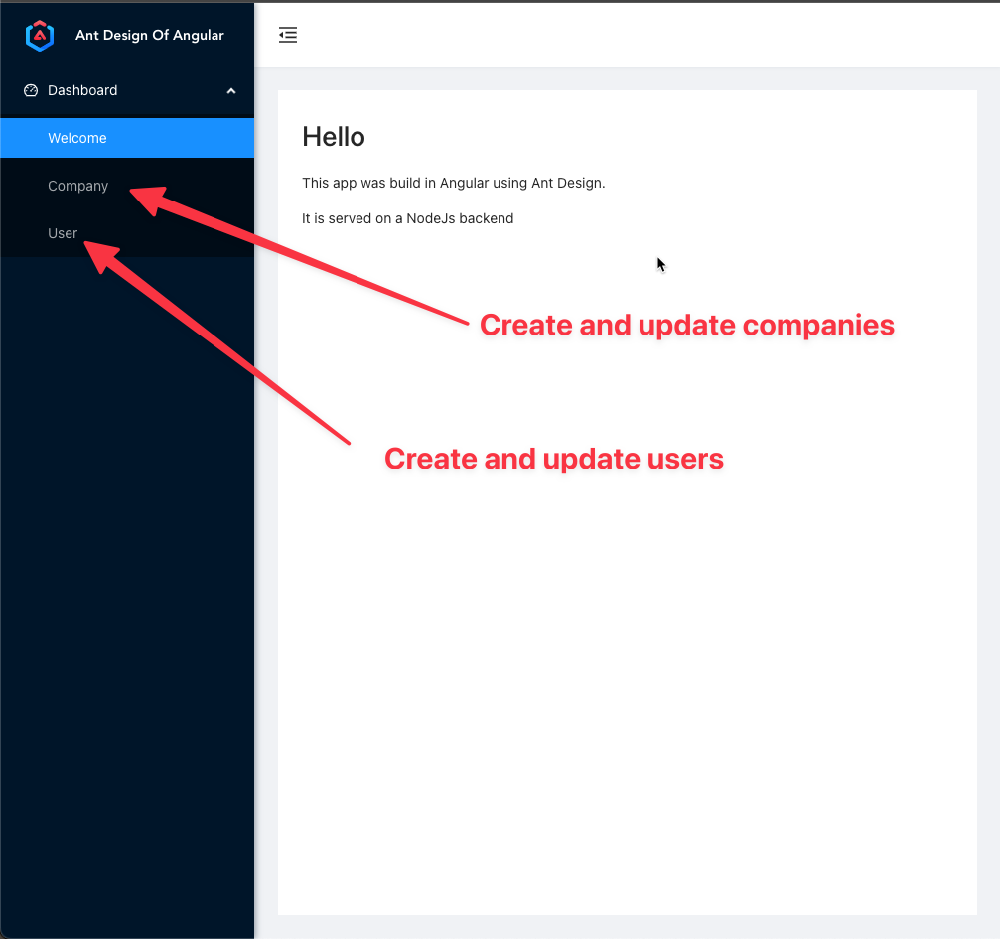
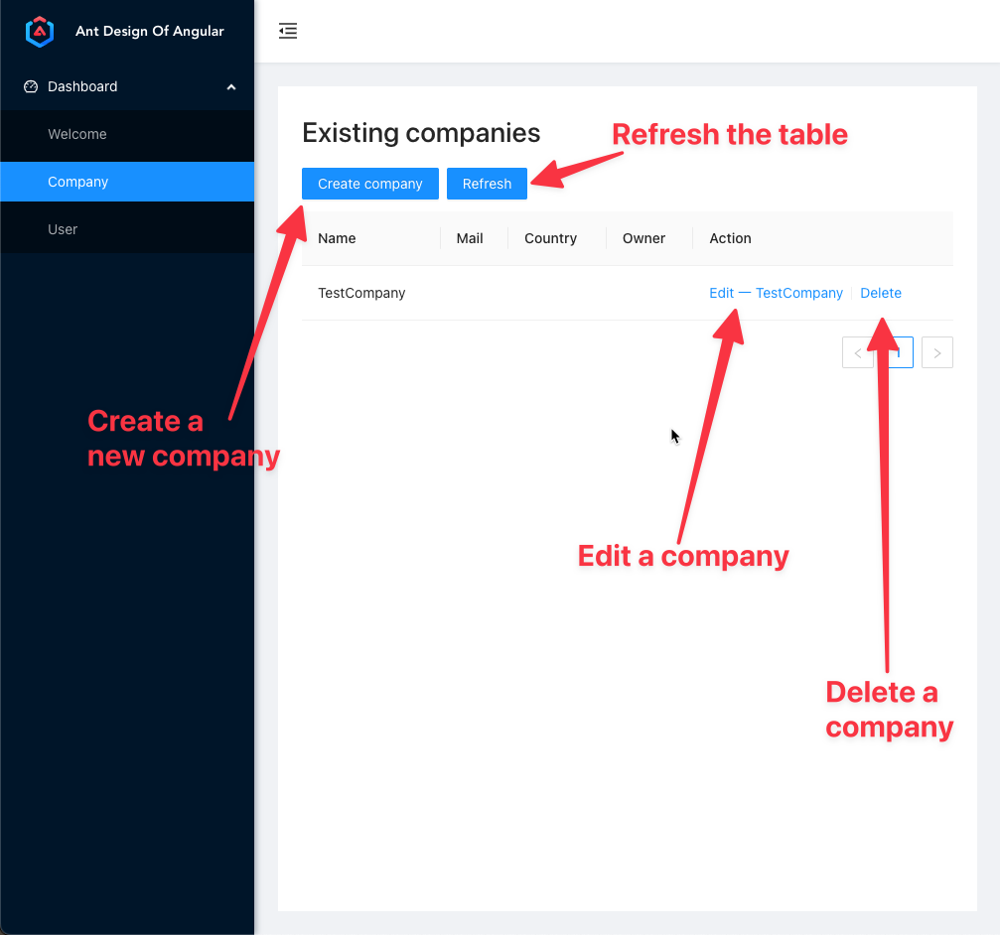
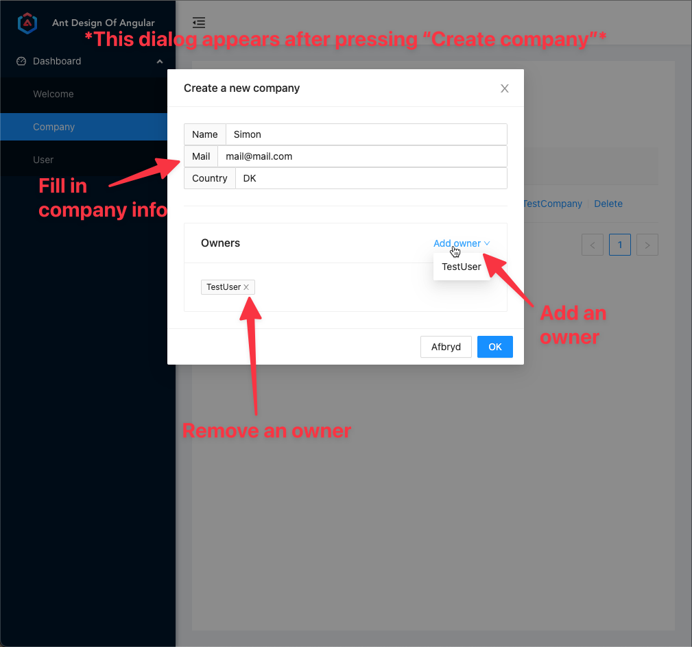

# full-stack-company-app

### Quick guide
To get started, all you need to do is run the commands in the Docker section below. \
The Frontend and Backend sections are only for informational purposes regarding starting them traditionally, outside a docker container

## Intro
* This project is made with express-generator-typescript - a npx package that builds nodejs+express apps with typescript setup build in.
* Normally .env files should not be in the git repo, but for ease of use, they are in this case (backend/src/pre-start/env)
* The assignment PDF (Full Stack Application Assignemnt.pdf) is located in root of this project.
* This project includes both frontend and backend. 
  * They build individually, but the `buildall.sh` will copy everything from the generated frontend/dist/frontend folder to the backend/dist/public folder

## Docker
To build and run in Docker container: \
`sh buildall.sh` \
`docker build -t company-app .` \
`docker run -d -p 8081:8081 --name company-conatiner company-app`

## Frontend
Angular + Ant Design \
**Expects backend to run in "production", aka on port 8081** \
Run with: \
`cd frontend` \
`ng serve`

### Frontend interaction guide

## Backend
Node.js with typescript + express -> generated by express-generator-typescript \
Run with: \
`sh buildall.sh` (placed in root) \
`cd backend` \
`npm run start`

## API
**See included Postman collections (root/postman) for more information (expects app to run on port 8081)**

Overview of API:
* Companies:
  * '/all', -> get all companies,
  * '/add', -> create a new company
  * '/update', -> Update an existing company
  * '/delete/:id', -> delete a company
$
* Users: // TODO: add params docs
  * '/all', -> get all users,
  * '/add', -> create a new user
  * '/update', -> Update an existing user
  * '/delete/:id', -> delete a user

# Backlog

[x] FE - link user to company \
[x] document API \
[ ] FE - make a table component, which can be shard between owner and company component \
[ ] FE - fix duplicate code between user and company modules \
[ ] FE - "prettyOwnerName()" in company.component is not a great solution! \
[ ] FE - UserModelFull is redundant, do like with CompanyModel \
[ ] FE - put the url used for endpoint in env.